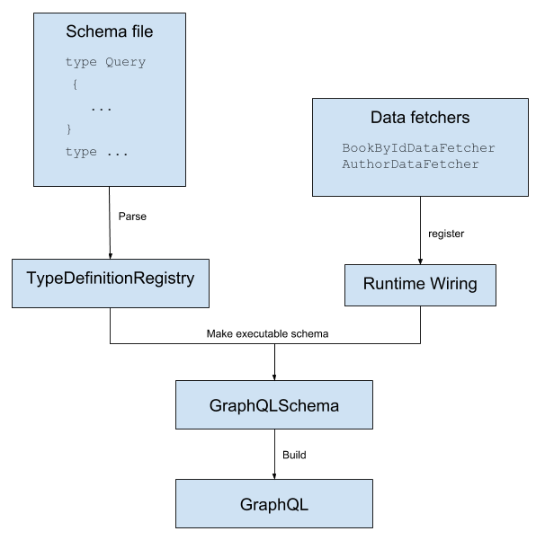

# example-spring-boot-graphql

## schema generation


## build
`gradle clean build`

## run
`gradle bootRun`

## usage
- install: [graphql-playground](https://github.com/graphql/graphql-playground)
- URL endpoint: [localhost:8080/graphql](http://localhost:8080/graphql)
- request:
```graphql
{
  bookById(id: "book-1"){
    id
    name
    pageCount
    author {
      firstName
      lastName
    }
  }
}
```

## links
- [GraphQL getting started](https://www.graphql-java.com/tutorials/getting-started-with-spring-boot/)
